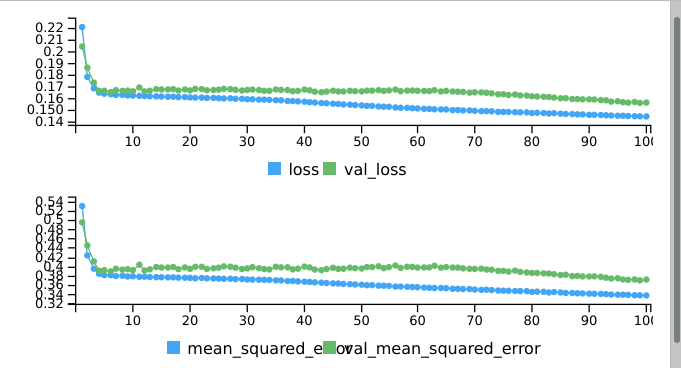
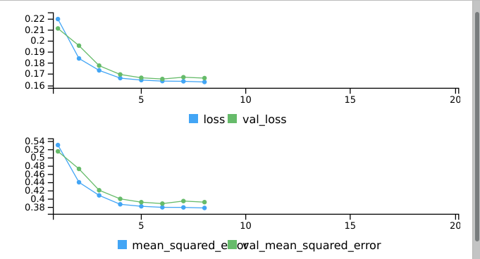
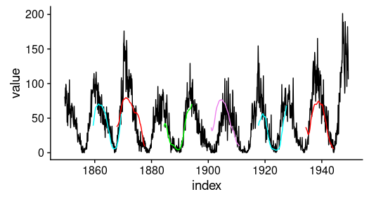
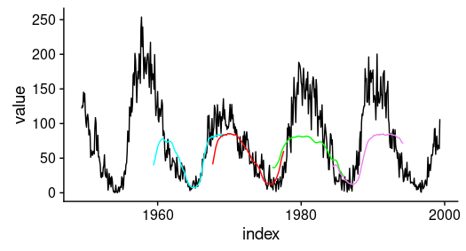
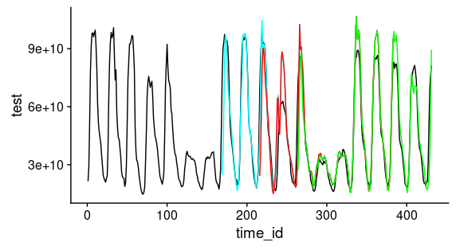

```{r setup, echo=FALSE, include=FALSE}
library(knitr)
opts_chunk$set(comment = "", message = FALSE, warning = FALSE)
```


```{r, echo=FALSE}
library(tidyverse)
library(tibbletime)
library(timetk)
library(tidyquant)
library(yardstick)
library(forecast)
library(recipes)
library(rsample)
library(keras)
```


### It is difficult to make predictions, especially about the future

While we're not going to delve into the history of this often-cited quote (see e.g. https://quoteinvestigator.com/2013/10/20/no-predict/), let us say why we're using it.
This is a follow-up to [Matt's original post on business-science.io](http://www.business-science.io/timeseries-analysis/2018/04/18/keras-lstm-sunspots-time-series-prediction.html), predicting monthly frequencies of sunspots (areas on the sun's surface that are temporarily cooler and darker), over a period of 10 years.

Striving to further improve on the solution, leveraging LSTM's (and similar RNN types') specific capabilities, it became clear, however, that the chosen task is all but easy. Let's take a look at the data:

```{r, echo=FALSE, fig.width=10}
sun_spots <- datasets::sunspot.month %>%
    tk_tbl() %>%
    mutate(index = as_date(index))

sun_spots %>%
    ggplot(aes(index, value)) +
    #geom_point(color = palette_light()[[1]], alpha = 0.5, size = 1) +
    geom_line() + 
    theme_tq() +
    labs(
        title    = "Monthly sunspots from 1749 to 2013")
```


Even though the data is discrete, we're displaying lines, to make it easier on us humans to grab the patterns.
At first glance, this data does not look too irregular: There are clearly visible cycles and also, it seems, a slight overall trend. So whenever we are in a cycle, we (resp. the forecasting algorithm we're using) should have a good idea of where we're going. Sure, there still is the problem of high variability, or noise. A smoothing filter, however, should be able to help us out here.

The problem is, we have been tasked to predict 120 samples - 10 years, that is. Assume we were at a bit after 1900, just having experienced two of the low-amplitude cycles. Our algorithm has learned that last time this happened, the following two cycles will gain momentum very quickly, and then we'll be headed south again. If it extrapolates from this, its predicted amplitudes will be way off.

Perhaps with an overall much longer series, we could see a pattern of Gaussians increasing in mean and variance.
But we don't have the data.

With the enormous difficulty of this task, all we can strive for is the least inaccurate solution. By the way: [SILSO](http://sidc.be/silso/home), a.k.a. _World Data Center for the production, preservation and dissemination of the international sunspot number_, offers a monthly forecast on their website. But evidently, those are not comparable tasks.

### Getting a baseline: ARIMA

Even though we're really interested in LSTM here, let's first see how ARIMA handles the challenge.
We're used to seeing ARIMA perform wonderfully on autoregressive-looking time series like this, but again, we are looking for 120-step-ahead predictions!

For preprocessing, we are using the same steps as in the original post, but we're not reproducing them, to allow for easier reading. In short, we will create training and test sets using a rolling resampling scheme, but here we'll just pick one of the splits (the last one). As explained later, we need to create longer, thus fewer splits, to provide the LSTM enough training and test data. Then, we take the square root (getting rid of at least _some_ of the noise) and standardize, just like before.

```{r, echo=FALSE}
periods_train <- 12 * 100
periods_test  <- 12 * 50
skip_span     <- 12 * 20

rolling_origin_resamples <- rolling_origin(
  sun_spots,
  initial    = periods_train,
  assess     = periods_test,
  cumulative = FALSE,
  skip       = skip_span
)

split    <- rolling_origin_resamples$splits[[6]]
split_id <- rolling_origin_resamples$id[[6]]
df_trn <- training(split)
df_tst <- testing(split)

df <- bind_rows(df_trn %>% add_column(key = "training"),
                df_tst %>% add_column(key = "testing")) %>%
  as_tbl_time(index = index)

rec_obj <- recipe(value ~ ., df) %>%
  step_sqrt(value) %>%
  step_center(value) %>%
  step_scale(value) %>%
  prep()

df_processed_tbl <- bake(rec_obj, df)

center_history <- rec_obj$steps[[2]]$means["value"]
scale_history  <- rec_obj$steps[[3]]$sds["value"]

train_vals <- df_processed_tbl %>%
  filter(key == "training") %>%
  select(value) %>%
  pull()
test_vals <- df_processed_tbl %>%
  filter(key == "testing") %>%
  select(value) %>%
  pull()

```

How does ARIMA see this time series?

```{r}
fit <- auto.arima(train_vals)
fit
```


Now what about the predictions? We want forecasts of length 120 at every timestep in the test set.
Thus, we start with the model obtained on the training set, and add test set samples one by one.
(This will work differently with LSTM, later, but it actually favors ARIMA, our baseline, so it's nothing to worry about.)
As described in RJ Hyndman's concise how-to [post on rolling forecasts](https://robjhyndman.com/hyndsight/rolling-forecasts/), when a new data point comes in, we can either completely re-compute the model, or inform ARIMA about the order of the original fit and just re-estimate the coefficients. Let's choose the latter method:

```{r}
# multistep forecasts, as per https://robjhyndman.com/hyndsight/rolling-forecasts/
# 2 variants:
# - reestimate model as new data point comes in
# - re-select complete model as new data point comes in
# we keep the complete training set (as would be realistic in a real-world scenario)
# however, this gives ARIMA an advantage that LSTM does not get
forecast_rolling <-
  function(fit, n_forecast, train, test, fmode = "reestimate_only") {
    n <- length(test) - n_forecast + 1
    order <- arimaorder(fit)
    predictions <- matrix(0, nrow = n, ncol = n_forecast)
    lower <- matrix(0, nrow = n, ncol = n_forecast)
    upper <- matrix(0, nrow = n, ncol = n_forecast)
    
    for (i in 1:n) {
      x <- c(train, test[0:(i - 1)])
      if (fmode == "reestimate_only") {
        # re-estimate parameters, given model
        if (!is.na(order[7])) {
          refit <-
            Arima(x,
                  order = order[1:3],
                  seasonal = list(order = order[4:6], period = order[7]))
        } else {
          refit <- Arima(x, order = order[1:3],  seasonal = order[4:6])
        }
      } else if (fmode == "recompute_model") {
        # re-select the whole model
        refit <- auto.arima(x)
      }
      predictions[i,] <- forecast(refit, h = n_forecast)$mean
      lower[i,] <-
        unclass(forecast(refit, h = n_forecast)$lower)[, 2] # 95% prediction interval
      upper[i,] <-
        unclass(forecast(refit, h = n_forecast)$upper)[, 2] # 95% prediction interval
    }
    
    list(predictions = predictions,
         lower = lower,
         upper = upper)
  }

```

```{r}
n_timesteps <- 120
preds_list <- forecast_rolling(fit, n_timesteps, train_vals, test_vals)
```

Let's jump over the post-processing step and look at the predictions. For visibility, we display just a few, but we're getting a clear impression:

```{r, echo=FALSE}
pred_test <- drop(preds_list$predictions)
pred_test <- (pred_test * scale_history + center_history) ^ 2
compare_test <- df_tst

for (i in 1:nrow(pred_test)) {
  varname <- paste0("pred_test", i)
  compare_test <-
    mutate(compare_test,!!varname := c(rep(NA, i - 1),
                                       pred_test[i,],
                                       rep(
                                         NA, nrow(compare_test) - n_timesteps - i + 1
                                       )))
}
coln <- colnames(compare_test)[3:ncol(compare_test)]
cols <- map(coln, quo(sym(.)))
rmse_test_arima <-
  map_dbl(cols, function(col)
    rmse(
      compare_test,
      truth = value,
      estimate = !!col,
      na.rm = TRUE
    )) %>% mean()
```

```{r, echo=FALSE}
ggplot(compare_test, aes(x = index, y = value)) + geom_line() +
  geom_line(aes(y = pred_test1), color = "cyan") +
  geom_line(aes(y = pred_test70), color = "red") +
  geom_line(aes(y = pred_test140), color = "green") +
  geom_line(aes(y = pred_test210), color = "violet") +
  geom_line(aes(y = pred_test280), color = "red") +
  geom_line(aes(y = pred_test350), color = "green") +
  geom_line(aes(y = pred_test420), color = "violet") +
  geom_line(aes(y = pred_test481), color = "cyan")

```


Clearly, if we desperately need to forecast 120 steps ahead, we need to try something else.
Can deep neural networks help us out here?

Before we go on, let's see the RMSE for our baseline (as RSME was the measure used in the original post):

```{r}
rmse_test_arima
```


### LSTM to the rescue?

As of today, among Recurrent Neural Networks (RNNs), the best established architectures are GRU (Gated Recurrent Unit) and LSTM (Long Short Term Memory), the one we will use in this post. For our current purpose, however, let's not zoom in on what makes them special, but on what they have in common with the most stripped-down RNN: the basic recurrence structure.

In contrast to the prototype of a neural network, often called Multi Layer Perceptron (MLP), the RNN has a state that is carried on over time. This is nicely seen in this diagram from the ["deep learning bible"](http://www.deeplearningbook.org):


At each time, the state is a combination of the current input and the previous hidden state. 
We'll come back to the nature of this combination later, but first delve into some code.

When predicting time series data with RNNs, it is this recurrence we are making use of. Concretely this means: We will feed the network sequences of input, and predict sequences of the desired output length (120 in our case). How long should we choose the internal recurrence to be? We know (from the original post) that about 120 timesteps fit in a complete cycle, and the network architecture will end up most straightforward if we choose state length to match output length.

First, we need to transform the data so we get a sliding window of 120 steps of input, followed by 120 steps of output. That is, if our input were the numbers from 1 to 10, and our chosen sequence length were 4, this is how we would want our training input to look:

```
1,2,3,4
2,3,4,5
3,4,5,6
```

And our target data, correspondingly:

```
5,6,7,8
6,7,8,9
7,8,9,10
```
Here by the way, you can see that we need more training and test data than if we just used a single time step. So if we wanted to do resampling cross validation, we'd have to get along with fewer splits.

So let's create our input and target arrays. The following code does this for the training set,- it works analogously for the test and validation sets. Validation set? When training a neural network - an often lenghty process - we want to monitor generalization performance right from the start. During training, we are going to see training as well as validation loss.
(Aside: We're going to take a shortcut here and use the training part from another split as a validation set, as you'll see in the complete code. For today, we'll completely focus on the "can LSTM help us with this hard task?" question.)

```{r, eval=FALSE}
# extract training data only
train_vals <- df_processed_tbl %>%
  filter(key == "training") %>%
  select(value) %>%
  pull()

# build a sliding window matrix
  build_matrix <- function(tseries, overall_timesteps) {
  X <- t(sapply(1:(length(tseries) - overall_timesteps + 1), 
                function(x) tseries[x:(x + overall_timesteps - 1)]))
 X
}

train_matrix <-
  build_matrix(train_vals, n_timesteps + n_predictions)

# cut into input and target halfs
X_train <- train_matrix[, 1:n_timesteps]
y_train <- train_matrix[, (n_timesteps + 1):(n_timesteps * 2)]

# add the third axis
dim(X_train) <- c(dim(X_train)[1], dim(X_train)[2], 1)
dim(y_train) <- c(dim(y_train)[1], dim(y_train)[2], 1)
```


The input and target each have to be of size _(batch size, sequence length, number of features)_.
This is why we added a third axis at the end, of length 1 (it would be longer if we had a multivariate time series).


### Basic network structure

Now that the data has been prepared, this is how our final network will look:


```{r, eval=FALSE}
model <- keras_model_sequential()
  
model %>%
  layer_lstm(
      units = n_units,
      batch_input_shape  = c(batch_size, n_timesteps, n_features),
      dropout = dropout,
      recurrent_dropout = recurrent_dropout,
      return_sequences = TRUE
  ) %>% time_distributed(layer_dense(units = 1))
```

As you see, here - and in the following snippets - we use variables for some of the hyperparameters.
These are the choices that after experimentation, yielded the best result for us (to keep this text uncluttered, comments may be found in the code):

```{r, eval=FALSE}
# using the so-called "stateful LSTM"" did not help performance 
stateful <- FALSE 
# neither did adding more LSTM layers
stack_layers <- FALSE
batch_size   <- 10
n_timesteps <- 120
n_predictions <- n_timesteps
# it's a univariate time series
n_features <- 1
# more than enough, as we'll see
n_epochs  <- 100
# number of LSTM cells - slightly improved performance as opposed to 64 (but not much)
n_units <- 128
# should help against overfitting. Instead, only worsened training performance, and thus, set to 0.
dropout <- 0
# same here
recurrent_dropout <- 0
# the loss function. Worked better than mean squared error and even, log mean squared error. 
loss <- "logcosh"
# set to false for demonstration purposes only. See below.
stop_early <- TRUE
# stochastic gradient descent with momentum worked best. For learning rate, see below.
optimizer_type <- "sgd"
lr <- 0.003
momentum <- 0.9
# other optimizer types were considered too (so the switch is not a pure curiosity)
optimizer <- switch(optimizer_type,
                    sgd = optimizer_sgd(lr = lr, momentum = momentum))
# explained below
callbacks <- list(
# callback_learning_rate_scheduler(function(epoch, lr) lr + epoch * 0.001))
  callback_early_stopping(patience = 2)
)
```


We compile and fit the model:

```{r, eval=FALSE}
model %>%
    compile(loss = loss, optimizer = optimizer, metrics = list("mean_squared_error"))
  
  
if (!stateful) {
    model %>% fit(
      x          = X_train,
      y          = y_train,
      validation_data = list(X_valid, y_valid),
      batch_size = batch_size,
      epochs     = n_epochs,
      callbacks = callbacks
    )
}
```

A note on the callbacks. At first, we used the learning rate scheduler callback to determine a good learning rate (broadly following Leslie Smith's papers on learning rate tuning, e.g., https://arxiv.org/abs/1506.01186 - and probably a topic for another post). Then, we let the model train for the whole 100 epochs, to get a feel for how/if it converges.

So here's the training and validation losses, plus the mean squared error metric, from that run:



Evidently, the learning rate was well chosen (judging from the rapid drop in loss) but training for so many epochs just makes us overfit on the training set. It looks like ~ 5 epochs are enough already!
So, we use another callback, the one for early stopping, to stop training as soon as validation loss does not decrease for a givev (here: 2) number of epochs. Let's see:



And now, let's see the result (perhaps check on ARIMA above to see our baseline again).

Here (to add one last delay before we turn to the test set forecast) are the predictions on the training set:


This is not bad at all. What jumps to the eye though is that for the highest-raising cycles, the maximum amplitudes are too low. Even when we set some hyperparameters so we clearly overfit, this does not change much. This is totally in line with what we observed above: When starting a new cycle, an algorithm cannot really know how far to go up! Therefore, we attribute this behavior to the intrinsic complexity of the task. 
Additionally, it intuitively makes sense when we consider how an RNN works. The weight matrices that combine input and previous state to form a new hidden state are _the same for each timestep_. So it's not surprising the network is looking for regular patterns!

Now - drumroll - let's check the forecasts on the test set!


Given the difficulty of the task, this is not too unreasonable! The RSME here is 38.5 - a little more than half than with ARIMA.

### Outlook

Let's sum up: We were given a hard task, and LSTM was not too bad at it. Of course, we don't want to leave it at that! Here's a quick preview of how even a 168-step-ahead forecast _can_ look, using this same architecture, on a different dataset:



Under what circumstances does LSTM deliver an excellent performance like this one?
We'll keep that question for another post. Stay tuned!

The complete code may be found here:tbd.
