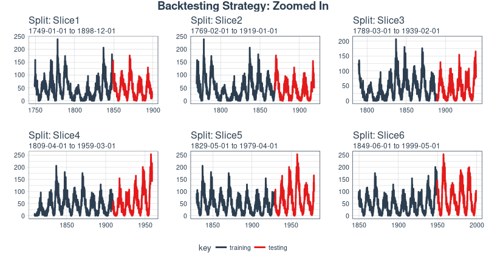
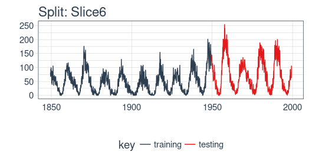

```{r setup, include=FALSE}
knitr::opts_chunk$set(
  echo = TRUE,
  message = FALSE,
  warning = FALSE,
  eval = FALSE,
  fig.width  = 8,
  dpi = 200
)
```


## Time Series Forecasting and Deep Learning

In the area of statistical learning - if you allow us, dear reader, to thus subsume statistics and machine learning into one, evading any fruitless "which is which" discussions - time series forecasting has traditionally been occupying a special position.

While machine learning in general turns to Kaggle for competitions, forecasting has its [own contests](https://robjhyndman.com/hyndsight/forecasting-competitions/), and the field has been shaped by a few highly influential personalities, such as [Rob Hyndman](https://robjhyndman.com/), whose [forecast](https://cran.r-project.org/web/packages/forecast/) package we all love as the Swiss army knife of timeseries analysis.

People and competitions aside, there are technical considerations specific to time series forecasting that don't apply to synchronous predictive analytics. When doing cross validation, we may not randomly split the data into validation and test, as we need to  keep sequential relationships intact. Instead, we need to apply a technique often (esp. in finance) called backtesting where we obtain various continuous stretches of training, validation and test data, making sure that we only ever use past data to make our predictions. Thus, an important part of this post is showing how to accomplish this using the _rsamples_ package.

Deep learning, as of the day we're writing this, has seen its most impressive successes in the areas of image recognition and generation, comprising tasks such as classification, localization, object detection, and image enhancement. More and more, natural language processing sees its tasks handled by end-to-end neural network models.

In business however, much as in finance, univariate and multivariate time series abound.
These time series do have something in common with both image data and language data: Like language, they form sequences, and like images, they are made up of homogeneous components - at least if we stay with univariate time series, which we are going to do in this post.

## Recurrent neural networks

When our data has a sequential structure, it is Recurrent Neural Networks (RNNs) we use to model it.

As of today, among RNNs, the best established architectures are the GRU (Gated Recurrent Unit) and the LSTM (Long Short Term Memory). For today, let's not zoom in on what makes them special, but on what they have in common with the most stripped-down RNN: the basic recurrence structure.

In contrast to the prototype of a neural network, often called Multilayer Perceptron (MLP), the RNN has a state that is carried on over time. This is nicely seen in this diagram from [Goodfellow et al.](http://www.deeplearningbook.org), a.k.a. the "bible of deep learning":


At each time, the state is a combination of the current input and the previous hidden state. This is reminiscent of autoregressive models, but with neural networks, there has to be some point where we stop the dependence.

That's because in order to determine the weights, we keep calculating how our loss changes as the input changes.
Now if the input we have to consider, at an arbitrary timestep, ranges back indefinitely - then we will not be able to calculate all those gradients.
In practice, then, our hidden state will, at every iteration, be carried forward through a fixed number of steps.

We'll come back to that as soon as we've loaded and pre-processed the data.

## Sunspots Data Set

[Sunspots](https://stat.ethz.ch/R-manual/R-devel/library/datasets/html/sunspot.month.html) is a famous data set that ships with R. Sunspots are dark spots on the sun, associated with lower temperature. Here's an image from NASA showing the solar phenomenon.

<figure>

<figcaption>Source: https://www.nasa.gov/content/goddard/largest-sunspot-of-solar-cycle</figcaption>
</figure>

&nbsp;

Here, we use the monthly version of the dataset, `sunspots.month` (there is a yearly version, too).
It contains 265 years' worth of data (from 1749 through 2013) on the number of sunspots per month. 


## Setup, pre-processing, and exploration

### Libraries

Here, first, are the libraries needed for this tutorial. 

```{r}
# Core Tidyverse
library(tidyverse)
library(glue)
library(forcats)

# Time Series
library(timetk)
library(tidyquant)
library(tibbletime)

# Visualization
library(cowplot)

# Preprocessing
library(recipes)

# Sampling / Accuracy
library(rsample)
library(yardstick) 

# Modeling
library(keras)
library(tfruns)
```


If you have not previously run Keras in R, you will need to install Keras using the `install_keras()` function.

``` {r, eval = F}
# Install Keras if you have not installed before
install_keras()
```


### Data 

The dataset, `sunspot.month`, ships with base R. It's a `ts` class (not tidy), so we'll convert to a tidy data set using the `tk_tbl()` function from `timetk`. We use this instead of `as.tibble()` from `tibble` to automatically preserve the time series index as a `zoo` `yearmon` index. Last, we'll convert the `zoo` index to date using `lubridate::as_date()` (loaded with `tidyquant`) and then change to a `tbl_time` object to make time series operations easier.

```{r}
sun_spots <- datasets::sunspot.month %>%
    tk_tbl() %>%
    mutate(index = as_date(index)) %>%
    as_tbl_time(index = index)

sun_spots
```

```
# A time tibble: 3,177 x 2
# Index: index
   index      value
   <date>     <dbl>
 1 1749-01-01  58  
 2 1749-02-01  62.6
 3 1749-03-01  70  
 4 1749-04-01  55.7
 5 1749-05-01  85  
 6 1749-06-01  83.5
 7 1749-07-01  94.8
 8 1749-08-01  66.3
 9 1749-09-01  75.9
10 1749-10-01  75.5
# ... with 3,167 more rows
```


### Exploratory Data Analysis

The time series is long (265 years!). We can visualize the time series both in full, and zoomed in on the first 10 years to get a feel for the series. 

#### Visualizing Sunspot Data With Cowplot

We'll make two `ggplot`s and combine them using `cowplot::plot_grid()`. Note that for the zoomed in plot, we make use of `tibbletime::time_filter()`, which is an easy way to perform time-based filtering. 

```{r, fig.height=7}
p1 <- sun_spots %>%
    ggplot(aes(index, value)) +
    geom_point(color = palette_light()[[1]], alpha = 0.5) +
    theme_tq() +
    labs(
        title = "From 1749 to 2013 (Full Data Set)"
    )

p2 <- sun_spots %>%
    filter_time("start" ~ "1800") %>%
    ggplot(aes(index, value)) +
    geom_line(color = palette_light()[[1]], alpha = 0.5) +
    geom_point(color = palette_light()[[1]]) +
    geom_smooth(method = "loess", span = 0.2, se = FALSE) +
    theme_tq() +
    labs(
        title = "1749 to 1759 (Zoomed In To Show Changes over the Year)",
        caption = "datasets::sunspot.month"
    )

p_title <- ggdraw() + 
    draw_label("Sunspots", size = 18, fontface = "bold", colour = palette_light()[[1]])

plot_grid(p_title, p1, p2, ncol = 1, rel_heights = c(0.1, 1, 1))
```


### Backtesting: Time Series Cross Validation

As hinted at in the introduction, when doing cross validation on sequential data, the time dependencies on preceding samples must be preserved. We can create a cross validation sampling plan by offsetting the window used to select sequential sub-samples. In essence, we're creatively dealing with the fact that there's no future test data available by creating multiple synthetic "futures".

A recent development which makes cross validation sampling plans very easy to implement is [the `rsample` package](https://topepo.github.io/rsample/). This includes __backtesting__ on time series. The vignette, ["Time Series Analysis Example"](https://topepo.github.io/rsample/articles/Applications/Time_Series.html), describes a procedure that uses the `rolling_origin()` function to create samples designed for __time series cross validation__. We'll use this approach.

#### Developing A Backtesting Strategy

The sampling plan we create uses 50 years (`initial` = 12 x 50 samples) for the training set and ten years (`assess` = 12 x 10) for the testing (validation) set. We select a `skip` span of twenty years (`skip` = 12 x 20) to evenly distribute the samples into 11 sets that span the entire 265 years of sunspots history. Last, we select `cumulative = FALSE` to allow the origin to shift which ensures that models on more recent data are not given an unfair advantage (more observations) over those operating on less recent data. The tibble return contains the `rolling_origin_resamples`.

```{r}
periods_train <- 12 * 100
periods_test  <- 12 * 50
skip_span     <- 12 * 20

rolling_origin_resamples <- rolling_origin(
    sun_spots,
    initial    = periods_train,
    assess     = periods_test,
    cumulative = FALSE,
    skip       = skip_span
)

rolling_origin_resamples
```

```
# Rolling origin forecast resampling 
# A tibble: 6 x 2
  splits       id    
  <list>       <chr> 
1 <S3: rsplit> Slice1
2 <S3: rsplit> Slice2
3 <S3: rsplit> Slice3
4 <S3: rsplit> Slice4
5 <S3: rsplit> Slice5
6 <S3: rsplit> Slice6
```

#### Visualizing the Backtesting Strategy

We can visualize the resamples with two custom functions. The first, `plot_split()`, plots one of the resampling splits using `ggplot2`. Note that an `expand_y_axis` argument is added to expand the date range to the full `sun_spots` dataset date range. This will become useful when we visualize all plots together. 

```{r}
# Plotting function for a single split
plot_split <- function(split, expand_y_axis = TRUE, alpha = 1, size = 1, base_size = 14) {
    
    # Manipulate data
    train_tbl <- training(split) %>%
        add_column(key = "training") 
    
    test_tbl  <- testing(split) %>%
        add_column(key = "testing") 
    
    data_manipulated <- bind_rows(train_tbl, test_tbl) %>%
        as_tbl_time(index = index) %>%
        mutate(key = fct_relevel(key, "training", "testing"))
        
    # Collect attributes
    train_time_summary <- train_tbl %>%
        tk_index() %>%
        tk_get_timeseries_summary()
    
    test_time_summary <- test_tbl %>%
        tk_index() %>%
        tk_get_timeseries_summary()
    
    # Visualize
    g <- data_manipulated %>%
        ggplot(aes(x = index, y = value, color = key)) +
        geom_line(size = size, alpha = alpha) +
        theme_tq(base_size = base_size) +
        scale_color_tq() +
        labs(
            title    = glue("Split: {split$id}"),
            subtitle = glue("{train_time_summary$start} to {test_time_summary$end}"),
            y = "", x = ""
        ) +
        theme(legend.position = "none") 
    
    if (expand_y_axis) {
        
        sun_spots_time_summary <- sun_spots %>% 
            tk_index() %>% 
            tk_get_timeseries_summary()
        
        g <- g +
            scale_x_date(limits = c(sun_spots_time_summary$start, 
                                    sun_spots_time_summary$end))
    }
    
    return(g)
}
```

The `plot_split()` function takes one split (in this case Slice01), and returns a visual of the sampling strategy. We expand the axis to the range for the full dataset using `expand_y_axis = TRUE`. 

```{r, fig.height=3.5}
rolling_origin_resamples$splits[[1]] %>%
    plot_split(expand_y_axis = TRUE) +
    theme(legend.position = "bottom")
```


The second function, `plot_sampling_plan()`, scales the `plot_split()` function to all of the samples using `purrr` and `cowplot`.

```{r}
# Plotting function that scales to all splits 
plot_sampling_plan <- function(sampling_tbl, expand_y_axis = TRUE, 
                               ncol = 3, alpha = 1, size = 1, base_size = 14, 
                               title = "Sampling Plan") {
    
    # Map plot_split() to sampling_tbl
    sampling_tbl_with_plots <- sampling_tbl %>%
        mutate(gg_plots = map(splits, plot_split, 
                              expand_y_axis = expand_y_axis,
                              alpha = alpha, base_size = base_size))
    
    # Make plots with cowplot
    plot_list <- sampling_tbl_with_plots$gg_plots 
    
    p_temp <- plot_list[[1]] + theme(legend.position = "bottom")
    legend <- get_legend(p_temp)
    
    p_body  <- plot_grid(plotlist = plot_list, ncol = ncol)
    
    p_title <- ggdraw() + 
        draw_label(title, size = 14, fontface = "bold", colour = palette_light()[[1]])
    
    g <- plot_grid(p_title, p_body, legend, ncol = 1, rel_heights = c(0.05, 1, 0.05))
    
    return(g)
    
}
```


We can now visualize the entire backtesting strategy with `plot_sampling_plan()`. We can see how the sampling plan shifts the sampling window with each progressive slice of the train/test splits. 

```{r, fig.height=8}
rolling_origin_resamples %>%
    plot_sampling_plan(expand_y_axis = T, ncol = 3, alpha = 1, size = 1, base_size = 10, 
                       title = "Backtesting Strategy: Rolling Origin Sampling Plan")
```


And, we can set `expand_y_axis = FALSE` to zoom in on the samples. 

```{r, fig.height=8}
rolling_origin_resamples %>%
    plot_sampling_plan(expand_y_axis = F, ncol = 3, alpha = 1, size = 1, base_size = 10, 
                       title = "Backtesting Strategy: Zoomed In")
```



We'll use this backtesting strategy (11 samples from one time series each with 50/10 split in years and a 20 year offset) when testing the veracity of the LSTM model on the sunspots dataset. 


## The LSTM model

To begin, we'll develop an LSTM model on a single sample from the backtesting strategy, namely, the most recent slice. We'll then apply the model to all samples to investigate/validate the modeling performance. 

```{r}
split    <- rolling_origin_resamples$splits[[6]]
split_id <- rolling_origin_resamples$id[[6]]
```

We can reuse the `plot_split()` function to visualize the split. Set `expand_y_axis = FALSE` to zoom in on the subsample. 

```{r, fig.height=3.5}
plot_split(split, expand_y_axis = FALSE, size = 0.5) +
    theme(legend.position = "bottom") +
    ggtitle(glue("Split: {split_id}"))
```



### Data Setup

First, let's combine the training and testing data sets into a single data set with a column `key` that specifies where they came from (either "training" or "testing)". Note that the `tbl_time` object will need to have the index respecified during the `bind_rows()` step, but [this issue](https://github.com/tidyverse/dplyr/issues/3259) should be corrected in `dplyr` soon. 

```{r}
df_trn <- training(split)
df_tst <- testing(split)

df <- bind_rows(
    df_trn %>% add_column(key = "training"),
    df_tst %>% add_column(key = "testing")
) %>% 
    as_tbl_time(index = index)

df
```

```
# A time tibble: 1,800 x 3
# Index: index
   index      value key     
   <date>     <dbl> <chr>   
 1 1849-06-01  81.1 training
 2 1849-07-01  78   training
 3 1849-08-01  67.7 training
 4 1849-09-01  93.7 training
 5 1849-10-01  71.5 training
 6 1849-11-01  99   training
 7 1849-12-01  97   training
 8 1850-01-01  78   training
 9 1850-02-01  89.4 training
10 1850-03-01  82.6 training
# ... with 1,790 more rows
```

### Preprocessing with recipes

The LSTM algorithm will usually work better if the input data has been centered and scaled. We can conveniently accomplish this using the `recipes` package. In addition to `step_center` and `step_scale`, we're using `step_sqrt` to reduce variance and remov outliers. The actual transformations are executed when we `bake` the data according to the recipe: 

```{r}
rec_obj <- recipe(value ~ ., df) %>%
    step_sqrt(value) %>%
    step_center(value) %>%
    step_scale(value) %>%
    prep()

df_processed_tbl <- bake(rec_obj, df)

df_processed_tbl
```

```
# A tibble: 1,800 x 3
   index      value key     
   <date>     <dbl> <fct>   
 1 1849-06-01 0.714 training
 2 1849-07-01 0.660 training
 3 1849-08-01 0.473 training
 4 1849-09-01 0.922 training
 5 1849-10-01 0.544 training
 6 1849-11-01 1.01  training
 7 1849-12-01 0.974 training
 8 1850-01-01 0.660 training
 9 1850-02-01 0.852 training
10 1850-03-01 0.739 training
# ... with 1,790 more rows
```

Next, let's capture the original center and scale so we can invert the steps after modeling. The square root step can then simply be undone by squaring the back-transformed data. 

```{r}
center_history <- rec_obj$steps[[2]]$means["value"]
scale_history  <- rec_obj$steps[[3]]$sds["value"]

c("center" = center_history, "scale" = scale_history)
```

```
center.value  scale.value 
    6.694468     3.238935 
```

### Reshaping the data

Keras LSTM expects the input as well as the target data to be in a specific shape.
The input has to be a 3-d array of size < num_samples, num_timesteps, num_features>.

Here, _num_samples_ is the number of observations in the set. This will get fed to the model in portions of _batch_size_. The second dimension, _num_timesteps_, is the length of the hidden state we were talking about above. Finally, the third dimension is the number of predictors we're using. For univariate time series, this is 1.

How long should we choose the hidden state to be? This generally depends on the dataset and our goal.
If we did one-step-ahead forecasts - thus, forecasting the following month only - our main concern would be choosing a state length that allows to learn any patterns in the data. 

Now say we wanted to forecast 12 months instead, as does [SILSO](http://sidc.be/silso/home), the _World Data Center for the production, preservation and dissemination of the international sunspot number_.
The way we can do this, with Keras, is by wiring the LSTM hidden states to sets of consecutive outputs of the same length. Thus, if we want to produce predictions for 12 months, our LSTM should have a hidden state length of 12.

These 12 time steps will then get wired to 12 linear predictor units using a _time_distributed()_ wrapper.
That wrapper's task is to apply the same calculation (i.e., the same weight matrix) to every state input it receives.

Now, what does the target array's format have to be? As we're forecasting several timesteps here, the target data again needs to be 3-dimensional. Dimension 1 again is the batch dimension, dimension 2 again corresponds to the number of timesteps (the forecasted ones), and dimension 3 is the size of the wrapped layer.
In our case, the wrapped layer is a _layer_dense()_ of a single unit, as we want exactly one prediction per point in time.

So, let's reshape the data. The main action here is creating the sliding windows of 12 steps of input, followed by 12 steps of output each. This is easiest to understand with a shorter and simpler example. Say our input were the numbers from 1 to 10, and our chosen sequence length (state size) were 4. Tthis is how we would want our training input to look:

```
1,2,3,4
2,3,4,5
3,4,5,6
```

And our target data, correspondingly:

```
5,6,7,8
6,7,8,9
7,8,9,10
```

We'll define a short function that does this reshaping on a given dataset.
Then finally, we add the third axis that is formally needed (even though that axis is of size 1 in our case).
_Note: When running the code, please execute the subsequent snippet before this one as it introduces a few needed variables (FLAGS$batch_size, FLAGS$n_timesteps and n_predictions). These are basically just the batch size used, the state length and the number of predictions, and are commented on below._

```{r}

build_matrix <- function(tseries, overall_timesteps) {
  X <- t(sapply(1:(length(tseries) - overall_timesteps + 1), 
                function(x) tseries[x:(x + overall_timesteps - 1)]))
  X
}

# training set
train_matrix <- build_matrix(train_vals, FLAGS$n_timesteps + n_predictions)

# cut into input and target halfs
X_train <- train_matrix[, 1:FLAGS$n_timesteps]
y_train <- train_matrix[, (FLAGS$n_timesteps + 1):(FLAGS$n_timesteps * 2)]

# cut off the last few items that would result in the last batch containing < batch_size items
# this is a purely technical requirement 
X_train <- X_train[1:(nrow(X_train) %/% FLAGS$batch_size * FLAGS$batch_size), ]
y_train <- y_train[1:(nrow(y_train) %/% FLAGS$batch_size * FLAGS$batch_size), ]

# add the third axis
dim(X_train) <- c(dim(X_train)[1], dim(X_train)[2], 1)
dim(y_train) <- c(dim(y_train)[1], dim(y_train)[2], 1)

# test set
test_matrix <- build_matrix(test_vals, FLAGS$n_timesteps + n_predictions)

# cut into input and target halfs
X_test <- test_matrix[, 1:FLAGS$n_timesteps]
y_test <- test_matrix[, (FLAGS$n_timesteps + 1):(FLAGS$n_timesteps * 2)]

# cut off the last few items that would result in the last batch containing < batch_size items
# this is a purely technical requirement 
X_test <- X_test[1:(nrow(X_test) %/% FLAGS$batch_size * FLAGS$batch_size), ]
y_test <- y_test[1:(nrow(y_test) %/% FLAGS$batch_size * FLAGS$batch_size), ]

# add the third axis
dim(X_test) <- c(dim(X_test)[1], dim(X_test)[2], 1)
dim(y_test) <- c(dim(y_test)[1], dim(y_test)[2], 1)
```


##### 5.1.6 Building the LSTM Model

Now that we have our data in the required form, let's finally build the model. 
As always in deep learning, an important, and often time-consuming, part of the job is tuning hyperparameters. To keep this post self-contained, and considering this is primarily a tutorial on how to use LSTM in R, let's assume the following settings were found after extensive experimentation (in reality experimentation did take place, but not to a degree that improvements coulnd'nt possibly be had ;-)).

Instead of hard coding the hyperparameters, we'll use [tfruns](https://tensorflow.rstudio.com/tools/tfruns/articles/tuning.html) to set up an environment where we could easily perform grid search.

We'll quickly comment on what these parameters do but mainly leave those topics to further posts.


```{r}
FLAGS <- flags(
  # there is a so-called "stateful LSTM" in Keras. While LSTM is stateful per se,
  # this adds a further tweak where the hidden states get initialized with values 
  # from the item at same position in the previous batch.
  # This is helpful just under specific circumstances, or if you want to create an
  # "infinite stream" of states, in which case you'd use 1 as the batch size.
  # Below, we show how the code would have to be changed to use this, but it won't be further
  # discussed here.
  flag_boolean("stateful", FALSE),
  # should we use several layers of LSTM?
  # Again, just included for completeness, it did not yield any superior performance on this task.
  # This will actually stack one additional layer of LSTM.
  flag_boolean("stack_layers", FALSE),
  # number of samples fed to the model in one go
  flag_integer("batch_size", 10),
  # size of the hidden state, equals size of predictions
  flag_integer("n_timesteps", 12),
  # how many epochs to train for
  flag_integer("n_epochs", 100),
  # fraction of the units to drop for the linear transformation of the inputs
  flag_numeric("dropout", 0.2),
  # fraction of the units to drop for the linear transformation of the recurrent state
  flag_numeric("recurrent_dropout", 0.2),
  # loss function. Found to work better for this specific case than mean squared error
  flag_string("loss", "logcosh"),
  # optimizer = stochastic gradient descent. Seemed to work better than adam or rmsprop here (as indicated by limited testing)
  flag_string("optimizer_type", "sgd"),
  # size of the LSTM layer
  flag_integer("n_units", 128),
  # learning rate
  flag_numeric("lr", 0.003),
  # momentum, an additional parameter to the SGD optimizer
  flag_numeric("momentum", 0.9),
  # parameter to the early stopping callback
  flag_integer("patience", 10)
)

# the number of predictions we'll make equals the length of the hidden state
n_predictions <- FLAGS$n_timesteps
# how many features = predictors we have
n_features <- 1
# just in case we wanted to try different optimizers, we could add here
optimizer <- switch(FLAGS$optimizer_type,
                    sgd = optimizer_sgd(lr = FLAGS$lr, momentum = FLAGS$momentum))

# callbacks to be passed to the fit() function
# we just use one here: we may stop before n_epochs if the loss on the validation set
# does not decrease (by a configurable amount, over a configurable time)
callbacks <- list(
  callback_early_stopping(patience = FLAGS$patience)
)
```


After all these preparations, the code for constructing and training the model is rather short!
Let's first quickly view the "long version", that would allow you to test stacking several LSTMs or use a stateful LSTM, then go through the final short version (that does neither) and comment on it.

This, just for reference, is the complete code.


```{r}
model <- keras_model_sequential()

model %>%
  layer_lstm(
    units = FLAGS$n_units,
    batch_input_shape  = c(FLAGS$batch_size, FLAGS$n_timesteps, n_features),
    dropout = FLAGS$dropout,
    recurrent_dropout = FLAGS$recurrent_dropout,
    return_sequences = TRUE
  )

if (FLAGS$stack_layers) {
  model %>%
    layer_lstm(
      units            = FLAGS$n_units,
      dropout = FLAGS$dropout,
      recurrent_dropout = FLAGS$recurrent_dropout,
      return_sequences = TRUE
    )
}
model %>% time_distributed(layer_dense(units = 1))

model %>%
  compile(
    loss = FLAGS$loss,
    optimizer = optimizer,
    metrics = list("mean_squared_error")
  )

if (!FLAGS$stateful) {
  model %>% fit(
    x          = X_train,
    y          = y_train,
    validation_data = list(X_test, y_test),
    batch_size = FLAGS$batch_size,
    epochs     = FLAGS$n_epochs,
    callbacks = callbacks
  )
  
} else {
  for (i in 1:n_epochs) {
    model %>% fit(
      x          = X_train,
      y          = y_train,
      validation_data = list(X_test, y_test),
      callbacks = callbacks,
      batch_size = FLAGS$batch_size,
      epochs     = 1,
      shuffle    = FALSE
    )
    model %>% reset_states()
  }
}

if (FLAGS$stateful)
  model %>% reset_states()

```


Now let's step through the simpler, yet better performing configuration below.

```{r}
# create the model
model <- keras_model_sequential()

# add layers
# we have just two, the LSTM and the time_distributed 
model %>%
  layer_lstm(
    units = FLAGS$n_units, 
    # the first layer in a model needs to know the shape of the input data
    batch_input_shape  = c(FLAGS$batch_size, FLAGS$n_timesteps, n_features),
    dropout = FLAGS$dropout,
    recurrent_dropout = FLAGS$recurrent_dropout,
    # by default, an LSTM just returns the final state
    return_sequences = TRUE
  ) %>% time_distributed(layer_dense(units = 1))

model %>%
  compile(
    loss = FLAGS$loss,
    optimizer = optimizer,
    # in addition to the loss, Keras will inform us about current MSE while training
    metrics = list("mean_squared_error")
  )

history <- model %>% fit(
  x          = X_train,
  y          = y_train,
  # see below
  validation_data = list(X_test, y_test),
  batch_size = FLAGS$batch_size,
  epochs     = FLAGS$n_epochs,
  callbacks = callbacks
)

```

What are the test data doing in the training procedure? They aren't used to adjust the network weights; just  for getting an impression of model performance and for the callbacks. If they are used for the callbacks, of course indirectly they _are_ being used for optimization,- if there was an easy way to obtain training, test and validation tests from the resampling procedure we'd prefer going that way.

However, we still have 5 other splits left over. On these, we will use the final procedure obtained on this split, that is, we will train on the relative test sets for the number of epochs effectively (i.e., after early stopping) having been made use of in this split, and then test on the relative testing sets.
That way, we should obtain an objective assessment of model performance.


